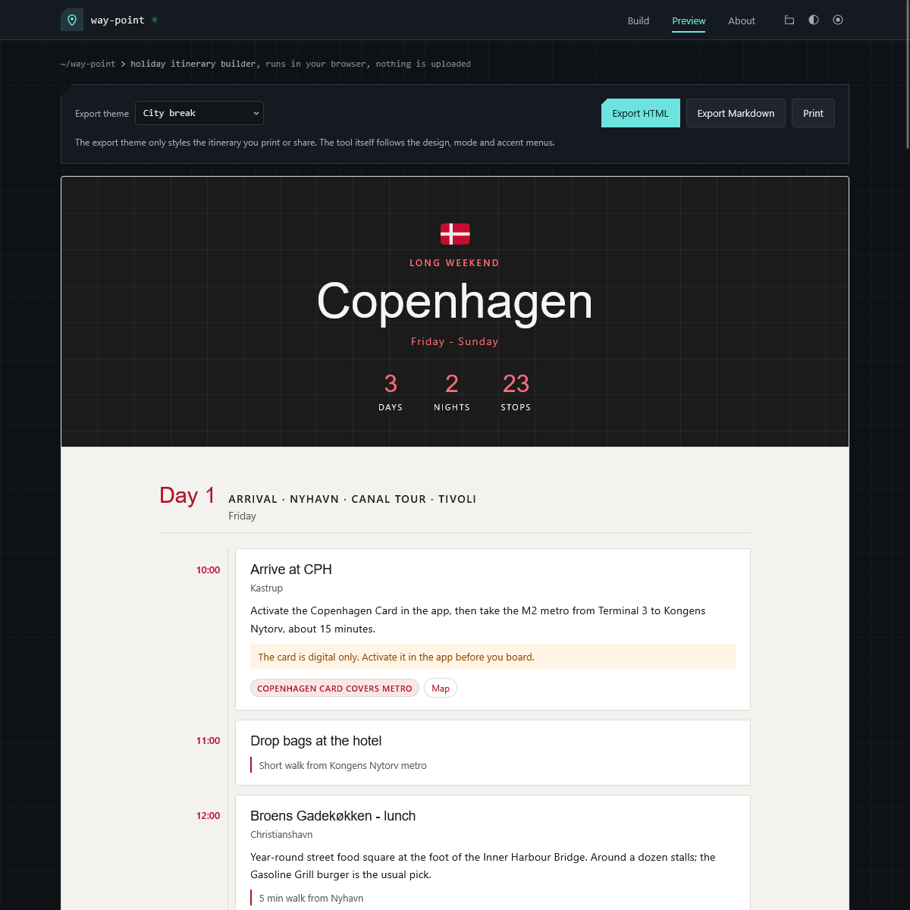

# way-point

Single-file, client-side holiday itinerary builder. Build a trip by hand, save it as JSON, load it back to edit, and export a self-contained HTML page or a Markdown file for printing or reading in a browser.

No build step, no dependencies, no network calls. Open `index.html` and it works, including from `file://`.



## Features

| Piece | Detail |
|---|---|
| Trip | Title, eyebrow, dates line, optional badge (emoji or short text), auto stats (days, nights, stops) |
| Days | Ordered days, each with a title, date and ordered stops |
| Stops | Time, name, location, description, tags, map link, warning, note |
| Extras | Tips grid, checklist (to book / to pack), costs table with total. Checklist items are tickable in the exported page with no script; ticks reset on reload |
| Appearance | The editor uses the shared tool template: design, mode and accent menus in the top bar |
| Export themes | Plain, Countryside, Beach, Winter, City break, Evening, Night out, Dusk, Romantic, Safari / rainforest. Every pairing checked for 4.5:1 text contrast |
| Save / load | JSON with `app` and `schema` stamps; drag a file onto the page or use Load JSON |
| Export | HTML (inline CSS, no scripts, strict CSP) and Markdown. The trip badge becomes the exported page's favicon |
| Print | Prints the itinerary only, never the editor form, on a light palette with cards kept whole |
| Demo | About tab loads a full Copenhagen long weekend |
| Shortcuts | Ctrl+S save, Ctrl+O load |

## Repository layout

```
index.html                    the tool
examples/copenhagen.json      3-day Copenhagen weekend (same as the built-in demo)
examples/berlin.json          3-day Berlin city break
.github/workflows/checks.yml  CI, see below
_headers                      response headers for Netlify / Cloudflare Pages
.htaccess                     response headers for Apache
```

## Map links

The map field takes either a full `https://` URL, used as given, or plain text such as `Nyhavn Copenhagen`, which becomes a Google Maps search link. Any other scheme (`http:`, `javascript:`, `data:`) is dropped.

## JSON format

Written for hand editing or for generating elsewhere. Only these fields are read; everything is treated as plain text and length-capped on load.

```json
{
  "app": "way-point",
  "schema": 1,
  "meta": {
    "title": "Copenhagen",
    "subtitle": "Long weekend",
    "dates": "Friday - Sunday",
    "badge": "",
    "nights": "",
    "currency": "EUR",
    "theme": "city",
    "showStats": true
  },
  "days": [
    {
      "title": "Arrival · Nyhavn · Canal tour · Tivoli",
      "date": "Friday",
      "stops": [
        {
          "time": "10:00",
          "name": "Arrive at CPH",
          "location": "Kastrup",
          "desc": "Take the M2 metro from Terminal 3 to Kongens Nytorv.",
          "tags": ["Copenhagen Card covers metro"],
          "map": "Copenhagen Airport Terminal 3",
          "note": "",
          "alert": "Activate the card in the app before you board."
        }
      ]
    }
  ],
  "tips": [{ "title": "Card, not cash", "text": "..." }],
  "checklist": [{ "text": "Copenhagen Card DISCOVER 72h", "note": "", "done": false }],
  "costs": [{ "item": "Flights", "amount": "180", "note": "Return" }]
}
```

`theme` is one of `plain`, `sunny` (Countryside), `beach`, `winter`, `city`, `evening`, `night`, `dusk`, `romantic`, `safari`. `nights` blank means days minus one. `tags` may be an array or a comma-separated string.

### Generating a trip with an LLM

Paste the format above and ask for the trip "as way-point JSON, schema 1, no extra fields". Load the result, then edit.

## Security

The page carries a Content-Security-Policy meta tag:

```
default-src 'none'; script-src 'unsafe-inline'; style-src 'unsafe-inline';
img-src data: blob:; connect-src 'none'; base-uri 'none'; form-action 'none'
```

- Nothing is loaded from another origin: no CDN, no webfont, no analytics. `connect-src 'none'` means the page cannot make a network request at all.
- `_headers` and `.htaccess` repeat the same policy as a response header, plus `frame-ancestors 'none'`, which browsers only honour in a header. Change all three together or none.
- All user text is escaped before it reaches HTML, including attributes. The preview is assembled only from escaped strings.
- Loaded files are rebuilt field by field, never merged, so unknown or hostile keys are discarded.
- The exported HTML has no scripts at all and its own CSP (`default-src 'none'; style-src 'unsafe-inline'; img-src data:`).
- State is kept in `localStorage` for this page only.

## CI

`.github/workflows/checks.yml` runs on every push and pull request. It calls the shared reusable workflow in `shanemc92/.github`, which:

- runs gitleaks over the full history
- fails on any off-origin `<script src>` or `<link href>`
- fails if the top-level `index.html` has no CSP meta tag
- runs `shellcheck -S warning` on any `*.sh`

This repo needs neither escape hatch (`skip-csp-check`, `allow-off-origin`).

## Licence

MIT, Shane McElhinney.
